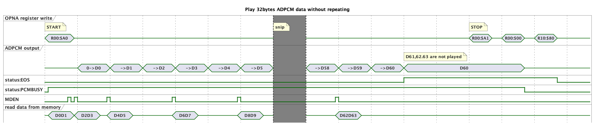
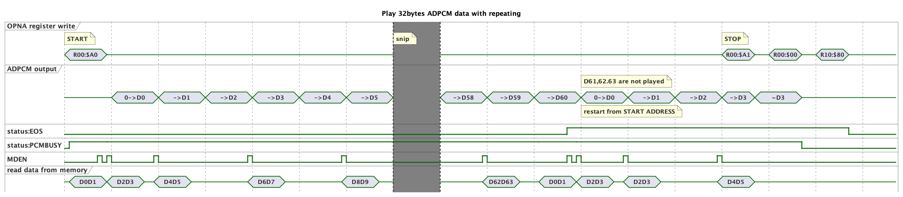

# YM2608(OPNA)のADPCM部の挙動解析メモ

実機を使って調べたYM2608(OPNA)のADPCM関連の動作のメモです。
FM音源エミュレータの精度向上の役に立てばと思っています。

## ADPCMデータ再生時の動作について

外部メモリに置いたADPCMデータを再生するときの挙動の調査結果です。

### リピート設定なしでの再生時の動作

32バイトのデータを再生した時の挙動。

|ADDRESS        | VALUE |
|:--------      |:------|
|START ADDRESS  |0x0001 |
|STOP ADDRESS   |0x0001 |
|LIMIT ADDRESS  |0xffff |

* 32バイト(64ニブル D0-D63)のデータのうち、D60までが再生され、最後の3ニブルのデータは再生されない。
  * 64バイトなど、他のサイズの時も同様に、最後の3ニブルのデータは再生されない。
* D60の再生が終わったところで、ステータスレジスタのEOSビットが1になる。
* D60再生後の出力レベルが維持される。
* 出力レベルは、REG00に$00を書いたときに0になる。ただし、次の再生時に見えるので内部では維持されている模様。
  この時にステータスレジスタのPCMBUSYビットも0になる。
* STOP ADDRESSの判定に先にヒットするので、LIMIT ADDRESSが0x0001の場合も、同じ挙動になる。

### リピート設定ありでの再生時の動作

32バイトのデータをリピート再生した時の挙動。

|ADDRESS        | VALUE |
|:--------      |:------|
|START ADDRESS  |0x0001 |
|STOP ADDRESS   |0x0001 |
|LIMIT ADDRESS  |0xffff |

* 32バイト(64ニブル D0-D63)のデータのうち、D60までが再生され、最後の3ニブルのデータは再生されない。
* D60の再生が終わったところで、ステータスレジスタのEOSビットが1になる。
* 直後に出力レベルは0に戻り、先頭のデータ(D0)を再生する。
* REG00に$A1を書いたとき(RESETビット)に再生が停止し、出力レベルが変化しなくなる。
* 出力レベルは、REG00に$00を書いたときに0になる。ただし、次の再生時に見えるので内部では維持されている模様。
  この時にステータスレジスタのPCMBUSYビットも0になる。
* STOP ADDRESSの判定に先にヒットするので、LIMIT ADDRESSが0x0001の場合も、同じ挙動になる。

### LIMIT ADDRESSに到達した時の動作

32バイトのデータをリピート再生した時の挙動。

|ADDRESS        | VALUE |
|:--------      |:------|
|START ADDRESS  |0x0001 |
|STOP ADDRESS   |0x0002 |
|LIMIT ADDRESS  |0x0001 |

* 32バイト(64ニブル D0-D63)のデータのうち、全データが再生され、アドレス0のデータに戻る。
* 出力レベルは0に戻らず、アドレス0のデータの再生を継続する。
* ステータスレジスタのEOSビットは変化しない。
* REG00に$A1を書いたとき(RESETビット)に再生が停止し、出力レベルが変化しなくなる。
  この時にステータスレジスタのEOSビットが1になる。
* 出力レベルは、REG00に$00を書いたときに0になる。ただし、次の再生時に見えるので内部では維持されている模様。
  この時にステータスレジスタのPCMBUSYビットも0になる。

## 外部メモリからのADPCMデータ読み出し時の動作について

外部メモリに置いたADPCMデータをCPUから読み出すときの挙動の調査結果です。

### 通常の読み出し時の動作

32バイトのデータを外部メモリから読み出した時の挙動。

|ADDRESS        | VALUE |
|:--------      |:------|
|START ADDRESS  |0x0001 |
|STOP ADDRESS   |0x0001 |
|LIMIT ADDRESS  |0xffff |

* 最初の2バイトはダミーリードとなり、以前読み出したであろうデータと思われるデータが読まれる。
* ダミーリードでメモリの読み出しが行われる。この時内部バッファにデータが読み込まれていると思われる。
* 最後の2バイト読み出し時は、メモリアクセスは発生しない。
* 32バイト目のデータを読み出したところで、ステータスレジスタのEOSビットが1になる。

### STOP ADDRESSを超えて読み出した時の動作

32バイトのデータを外部メモリから読み出し、さらにSTOP ADDRESSを超えて読み出した時の挙動。

|ADDRESS        | VALUE |
|:--------      |:------|
|START ADDRESS  |0x0001 |
|STOP ADDRESS   |0x0001 |
|LIMIT ADDRESS  |0xffff |

* 32バイト目のデータを読み出したところで、ステータスレジスタのEOSビットが1になる。
* 33バイト目の読み出しでSTART ADDRESSに戻る。
* その後の2バイトはダミーリードとなる。

### 読み出しでLIMIT ADDRESSに到達した時の動作

データの読み出し中にLIMIT ADDRESSに到達した時の挙動。

|ADDRESS        | VALUE |
|:--------      |:------|
|START ADDRESS  |0x0001 |
|STOP ADDRESS   |0x0002 |
|LIMIT ADDRESS  |0x0001 |

* 33バイト目の読み出しでアドレス0のデータに戻る。
* ダミーリードは発生しない。
* ステータスレジスタのEOSビットも0のまま変化しない。

## レジスタの挙動メモ
### START/STOPアドレスの挙動

* STOPアドレスを超えて書き込むと、STARTアドレスに戻る。
* STOPアドレスを超えて読み出すと、STARTアドレスに戻る。
  * 戻る際には、再度ダミーリード2回が発生する。
  * REPEATビットが1だとダミーリードは1回になる。
* ダミーリードの1バイト目でSTARTアドレスがロードされる。
  * 途中で変更しても読み出しアドレスは変わらない。
* STOPアドレスは、途中で変更されると、反映される。
* STOPアドレスのチェックは大小比較ではなく、等しいかどうかで行われる。

### LIMITアドレスの挙動

* STOPアドレスのチェックが先に行われる。
  * メモリ読み書き、再生時共に。
* LIMITアドレスで0番地に戻った場合は、ダミーリードは発生しない。
* LIMITアドレスのチェックは大小比較ではなく、等しいかどうかで行われる。

### STATUSレジスタの挙動

* bit.2 EOS
  * 最後のバイトを読むときに1になる。
    fmgenの挙動は間違っている。
* bit.6 Undocumented
  * メモリ読み出し時に1になることがある。
    読み出すデータに依存している様子。

### 読み書きの挙動

* メモリREADシーケンス中にレジスタ8にWRITEを入れるとアドレスは進む。
  * ただしデータは書き込まれない。
